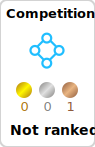

  <!-- Typing SVG by DenverCoder1 - https://github.com/DenverCoder1/readme-typing-svg -->
  

# Profile as a Reseacher(Click to jump)

[</a>](https://researchmap.jp/sakai1250)

## Commits
<picture>
  <source media="(prefers-color-scheme: dark)" srcset="https://raw.githubusercontent.com/platane/platane/output/github-contribution-grid-snake-dark.svg">
  <source media="(prefers-color-scheme: light)" srcset="https://raw.githubusercontent.com/platane/platane/output/github-contribution-grid-snake.svg">
  
</picture>

# Tech Stack:
### Programming languages

### Frameworks

### DevOps

## Organizations

## My Apps

<table>
  <tr>
    <td align="center" width="50%">
      <a href="https://apps.apple.com/jp/app/kikonashi/id6502258139">
         
        <b>kikonAshI (iOS)</b>
      </a>
      

        独自開発したファッションAIを搭載するアプリ。  
        毎日着る服の組み合わせをAIが提案し、ユーザーがコーディネートを考える手間を削減。  
        季節やシーンに応じたスタイルも考慮し、育成機能も搭載。  
      

      <a href="https://apps.apple.com/jp/app/kikonashi/id6502258139">App Store</a> | <a href="https://github.com/sakai1250/hacku2023">GitHub</a>
    </td>
    <td align="center" width="50%">
      <a href="https://www.jogiken.com/sugosugiru/">
         
        <b>すごすぎる時間割 (iOS/Android)</b>
      </a>
      

        情報技術研究会の一員として開発に協力した時間割アプリ。  
        シンプルなUIで授業や予定を直感的に管理。  
        スマホ上で簡単に時間割を確認できる。  
      

      <a href="https://apps.apple.com/jp/app/%E3%81%99%E3%81%94%E3%81%99%E3%81%8E%E3%82%8B%E6%99%82%E9%96%93%E5%89%B2/id6744370038">iOS</a> | <a href="https://play.google.com/store/apps/details?id=com.jogiken.sugosugiru">Android</a>
    </td>
  </tr>
  <tr>
    <td align="center">
      <a href="https://github.com/sakai1250/HackU2022">
         
        <b>StylePlan (Web/iOS)</b>
      </a>
      

        大学生の一人暮らしを支えるアプリ。  
        天気予報、ToDoリスト、料理レシピ提案、音楽週間ランキングTop3という  
        4つの機能をまとめて提供し、生活のあらゆる場面で役立つ。  
      

    </td>
    <td align="center">
      <a href="https://github.com/jphacks/F_2208">
         
        <b>貯Pay箱 (Web)</b>
      </a>
      

        PayPayなどの電子マネーとToDo管理を組み合わせたWebアプリ。  
        タスクを達成することでポイントやモチベーションを可視化し、  
        チームや個人でのモチベーション維持と共有を促進する。  
      

    </td>
  </tr>
  <tr>
    <td align="center">
      <a href="https://github.com/sakai1250/super_res.git">
         
        <b>超kAI蔵 (iOS)</b>
      </a>
      

        AIが最大4倍で高解像度化を実現するiOSアプリ。  
        画像の超解像だけでなく、フォルダ分類・メモ保存・検索機能も搭載し、  
        研究用途から日常利用まで幅広く使える。  
      

      <a href="https://apps.apple.com/jp/app/超kai蔵/id6751739848">App Store</a>
    </td>
    <td align="center">
      <a href="https://github.com/jphacks/F_2107">
         
        <b>NERO (Android)</b>
      </a>
      

        毎日のタスクを管理すると同時に、睡眠時間を自動で記録できるアプリ。  
        健康管理と作業効率を両立させるための習慣化をサポート。  
      

    </td>
  </tr>
  
  <tr>
    <td align="center">
      <a href="https://mind-shuffle.web.app/">
         
        <b>mind shuffle (Web/iOS)</b>
      </a>
      

        コーパスからランダムに単語を音声で再生するアプリ。  
        カテゴリや再生間隔をユーザーが選択でき、語学学習やアイデア発想に活用。  
      

    </td>
    <td align="center">
      <a href="https://itunes.apple.com/jp/app/id6755966828?mt=8">
         
        <b>おつりDoctor (iOS)</b>
      </a>
      

        硬貨をカメラで撮影するだけで金額を自動集計できるアプリを開発。  
        ユーザー育成機能付き。
      

      <a href="https://itunes.apple.com/jp/app/id6755966828?mt=8">App Store</a> | <a href="https://github.com/sakai1250/otsuri_docter">GitHub</a>
    </td>
  </tr>
    <tr>
    <td align="center">
      <a href="https://github.com/sakai1250/Who-is-the-Ground-Truth-">
         
        <b>Who is the Ground Truth? (iOS)</b>
      </a>
      

        AIと対戦できるアプリ。画像AIとあなたで直接対決。  
        真のGround Truthは誰だ！？
      

      <a href="https://apps.apple.com/jp/app/id6755972438">App Store</a> | <a href="https://github.com/sakai1250/Who-is-the-Ground-Truth-">GitHub</a>
    </td>
    <td align="center">
        <b>iOSローカルLLMアプリ(iOS)</b>
      </a>
      

        開発中
      

    </td>
  </tr>
      <tr>
    <td align="center">
      <a href="https://recolle.vercel.app/">
         
        <b>recolLe ~NFC Photo Albam~ (Web・iOS)</b>
      </a>
      

        iOS版の作成を担当。web撮って終わりの写真を、「かざす」という動きで呼び出す。
        お気に入りの写真をアクリルキーホルダー化し、スマートフォンをかざすだけで自然に思い出を振り返ることができる。
      

       <a href="https://recolle.vercel.app/">Web | <a href="https://apps.apple.com/jp/app/id6755230226">App Store</a>
    </td>
    <td align="center">
        <b></b>
      </a>
      

        開発中
      

    </td>
  </tr>
</table>

## Playround

<table>
  <tr>
    <td align="center" width="50%">
      <a href="https://github.com/sakai1250/ML_app_flask_test">
         
        <b>金魚画像識別サイト</b>
      </a>
      

        Flaskを用いて構築した金魚画像識別のWebアプリ。  
        ユーザーが金魚の画像をアップロードすると、AIモデルが種類を判別して表示する。  
      

    </td>
    <td align="center" width="50%">
      <a href="https://github.com/sakai1250/RL_super_mario_bro">
         
        <b>SuperMario強化学習</b>
      </a>
      

        強化学習を用いて「スーパーマリオブラザーズ」を自動プレイさせるプロジェクト。  
        ステージ 1-1, 1-3, 3-4, 4-1 クリア。  
      

    </td>
  </tr>
  <tr>
    <td align="center">
      <a href="https://github.com/sakai1250/Block_KUZUSHI_unity">
         
        <b>ブロック崩しゲーム</b>
      </a>
      

        Unityで制作したクラシックなブロック崩しゲーム。  
      

    </td>
    <td align="center">
      <a href="https://github.com/sakai1250/Tetorinu/tree/main">
        <b>テトリヌ</b>
      </a>
      

        学部1年時に初めて作ったテトリス風ゲーム。  
        学科内の投票で3位を獲得。
      

    </td>
  </tr>
</table>

## Kaggle

# GitHub Stats:

  

## Socials:
 [![Qiita](https://img.shields.io/badge/--FFFFFF?style=social&logo=data:image/vnd.microsoft.icon;base64,iVBORw0KGgoAAAANSUhEUgAAAHgAAAB4CAMAAAAOusbgAAAAGXRFWHRTb2Z0d2FyZQBBZG9iZSBJbWFnZVJlYWR5ccllPAAAADNQTFRFgNRA9PvvquJ/1PC/YMkQddAwv+mfaswgyu2v6vjf3/TPldtgoN5witdQtOaPVcUA////rKcmfAAAABF0Uk5T/////////////////////wAlrZliAAAFI0lEQVR42tSb67qrKAyGw0FAQOn9X+3Udmk9JBAQZ57h7+7iFcjhI2TD6z8a8P8BCzVLAJ22YWGSzj8LHk2wiRgQnXgG7CIJ3eDz2Bvso06sMcyiI9gMqWIE3wcspE6VA9R9cAOWhS6BTRP2gx5vgP2QbowoGsEipnvDqibwveWWFk2D59RjDL4SLKbUZ2hTBR6H1G3ECrDXqeOYBBfsunLfBy14YJN6D4QM/wYXI1/BLqV/gwz97Sooh/jEUACPd7mwRIwR+54sWLD9V8NnnL5Tz995sGlkDsyKV0Pci0rv4oYJ60kC9neOBjPi82QQpxRm+eLhl4xQsB4psC/urxxppTLvp8XPnwCXDtgavmrGZ5A4OBZWW6HXAzGJx8CXjQbgS6jTkJSzYeAB+Tol/+DzYV4lp79fDyBVBfg3D5AhenN4NU92ryNUOAeZybHBWpzBQrPy98tYjt2R4M2+gPzpgGEVeW8bFA+cxiNYXGO0qNS7kZdawxEsCxGOo3d3qU+l0pJXsC6mE0bC3NlgSIVTBnprbH2i3kVjOt18DRvoNJbGeoHw2+1M/DU/sKd/sM5jeWl6Ynzp8APHnP3lon4mNGUs229g/ONsy0VqPWaXOea4gl3e11Evz262e0fVkdZvdgXHQlzNOQdiGlEnHVwufvk/sE154xorL4hhjT2WNgSg57VMhXAZqmhf8AWbwoJflVo7KCUlmNySv+BQOOGGS80AUeWWrD5gS9m8WgSGUdXFgV2G1FS8foMF6UujnMDWL3cvJiXlc0ClsJ8OEA07HaQSOYcYFvDcHPpoJbzcqTLp5/2PQO3GJ2pFSE3jc6XKBlsPRPz/OrGRTqmG+t5ONRF7rShwYAk3hlkTez0DYfG/cBn1PTC+YfINziUmB8kOt7aaCD8keN3lt1KXTcZVOOSJAMP63NNUTT3KRPSogADvVY+qr/uU78oUeF8oqY9cx4tUbAW/asO1FuULHAVWL3aloFRXws2aBfa3FozbCAv8qovY58seCg4scJVdXy70igogtgh+Ta2ulAVDGcwvcSKlMBTsAF/OuZLDJKOPPYpKi5JhIC/BMDCi8oeCBeB+JpEHsEJ6vNaccn68SB/PA+cedDVa081ELvjo6kKd9dAmMFwL5nH21XXN+AFD+QVhf2ROrsMoxahrDqjxAxGL+3WaCFzgAHH6qhvY4UoBiG+S3cABD29AJIF+PUAaj29AqX3x4E4vkwMlBE0nsCTqM0BZ/PQg2GzguVRQ7AsWG/hBux6JlA2kzWvx1JLVDuwfdOUJDcdA67leSz6LCHMAq/ScYR/J9vQKAxwd0kqWEKR6jznoNUBATqD02uz9N8yXlzZIVWm5X1/myFPJDzSExq5kM7HB+HtHI9mUtAQUr0ggGsOVFeyevVh6P+OaLpRNEzgXlcrguUn/3GYB6xnPVoQStzOVYeQ2C5KVWuChxeldWztusyBd77DFbl7hwnXHqD5FKCWxQ9agu5jF1sZw+WDFAxduwnaS6kgflw7zbEUKDKtnj3MH/2ttAmCWZTQwOtgq6g7NpS+iWbA/2TDbI3uTeWdc/3xaOmBX03sru3GJUE/eCnt1owI3gPz8E54xZ0ZHuXxqm0vgl7+5aMlOi1cFc+OkwbOFAKrFW3fZscUeZWQtPl1uaOQUWcba/xwyMOoYwBQWFUE0sGpk7LKSj6xXoFw1tQ28sOe8e9lg+Bq8tpD268g8+U40ddWapgqef6sdOX0lSFiKuA2XjX8EGAA+EkbvnTUZgQAAAABJRU5ErkJggg==&label=Qiita)](https://qiita.com/sakai1250)

